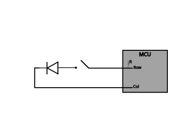

# Matrix scanning algorithm

The matrix scanning algorithm uses negative logic to detect key presses, ie. reading a 0 indicates that a switch has been pressed and driving an output to 0 is to drive it to the 'active' state.
The switch matrix diodes are placed facing from row to column so current can flow in this direction only. The columns are driven as outputs and the rows are read as inputs, the default state is no columns driven, ie. all column outputs are driven to the 1 'inactive' state and the row inputs are allowed to float high by their internal pull-up resistor.
The matrix is scanned with the following method;

1. Drive the first column output low while leaving all other column outputs high
2. Read back all row values simultaneously
3. Drive the current column high
4. Drive the next column low while leaving all other column outputs high
5. Repeat from step 2

When a switch is pressed, the path between the microcontrollers internal pull-up resistor and the diode is closed. When the corresponding column drives low the diode is allowed to conduct and a low is seen at the microcontroller row input pin. The columns are scanned much faster than a switch press event to guarantee that every switch press is captured.

A switch press event is processed when the rows are read back; if one or more of the row values are low then the switch(s) located at position (row, col) is being pressed. Note that the diodes allow any keyswitch combination to be decoded uniquely. Since the switch press is recorded in negative logic, the final result is inverted in the firmware before handing over to the switch decoding logic where the matrix position is mapped to a key switch value.

     

