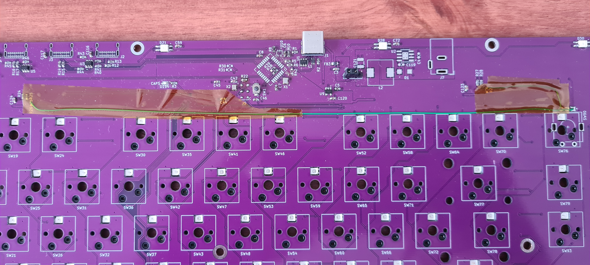
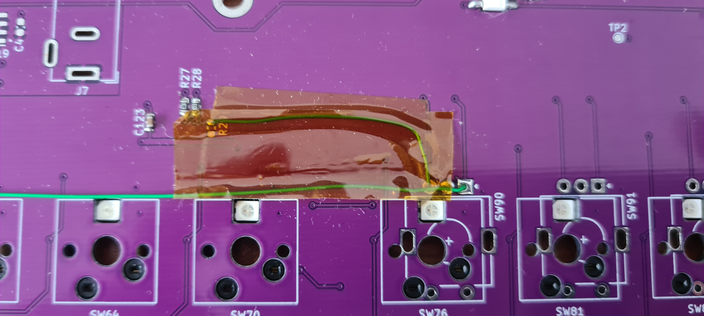
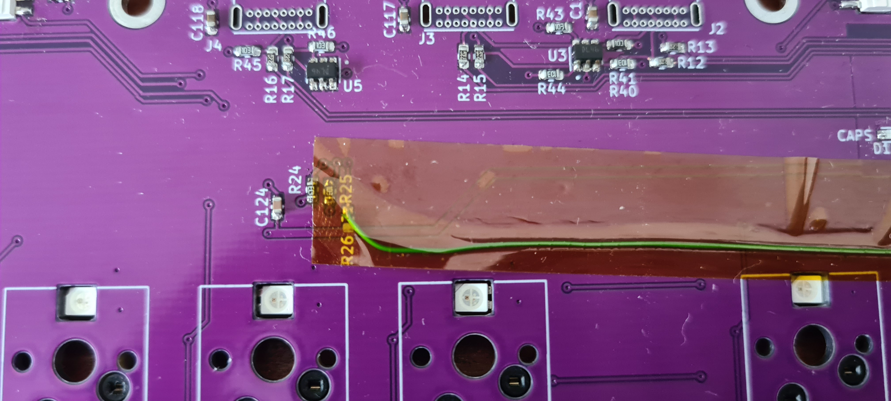

## TKL Keyboard v0 issues

 

1. I2C lines connected incorrectly to ATMEGA32U4

The I2C lines are not connected to the dedicated I2C hardware pins PD1 and PD0 on the ATMEGA32U4. The OLED display cannot be driven on the v0 board.

*Fixes:* Cannot be fixed in hardware as the dedicated I2C pins are used to drive the switch matrix.

2. Line decoders are never disabled

In order for the matrix scanning algorithm to work correctly, each line decoder output needs to be disabled (set to 0xFF) while the other side of the matrix is being scanned.

*Fixes:* This can be achieved by driving pin 6, E3 low. Pins from rotary encoder 2 were repurposed to make this connection on the v0 board. The V1 board features just 2 rotary encoders as a result.

    

    

    

